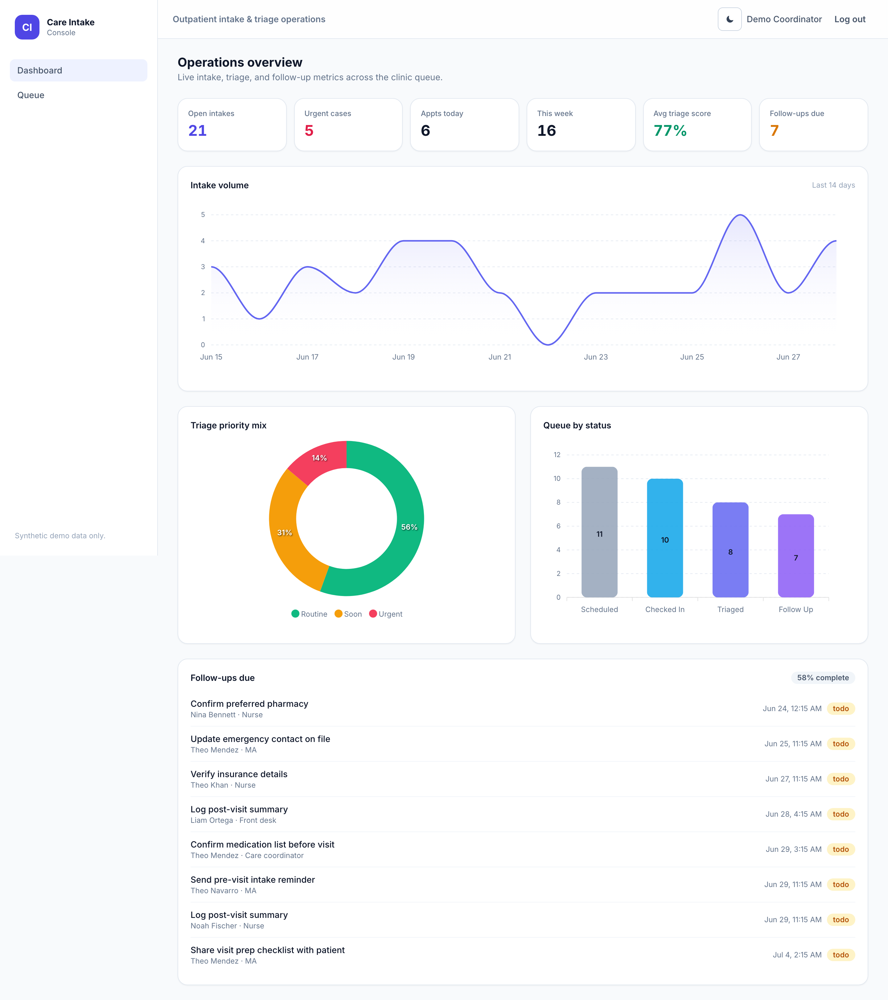
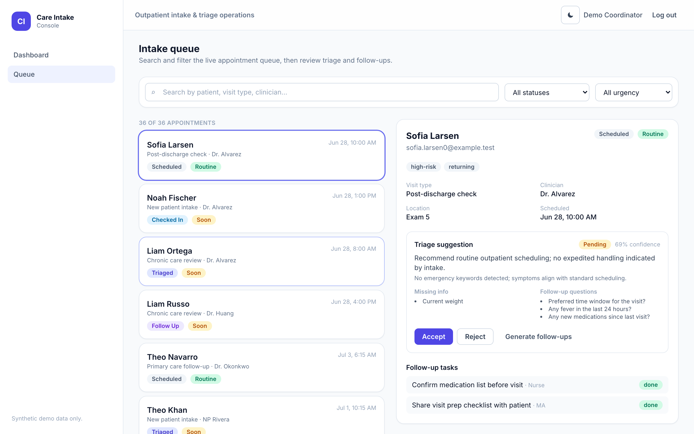
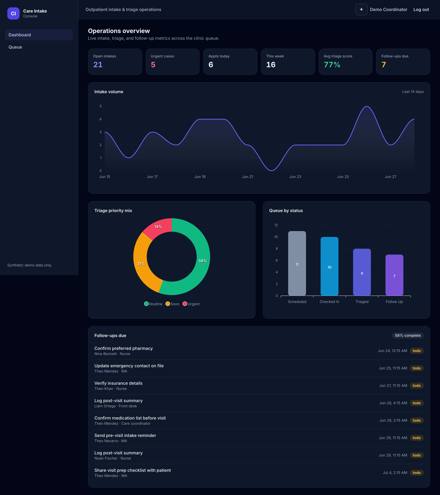
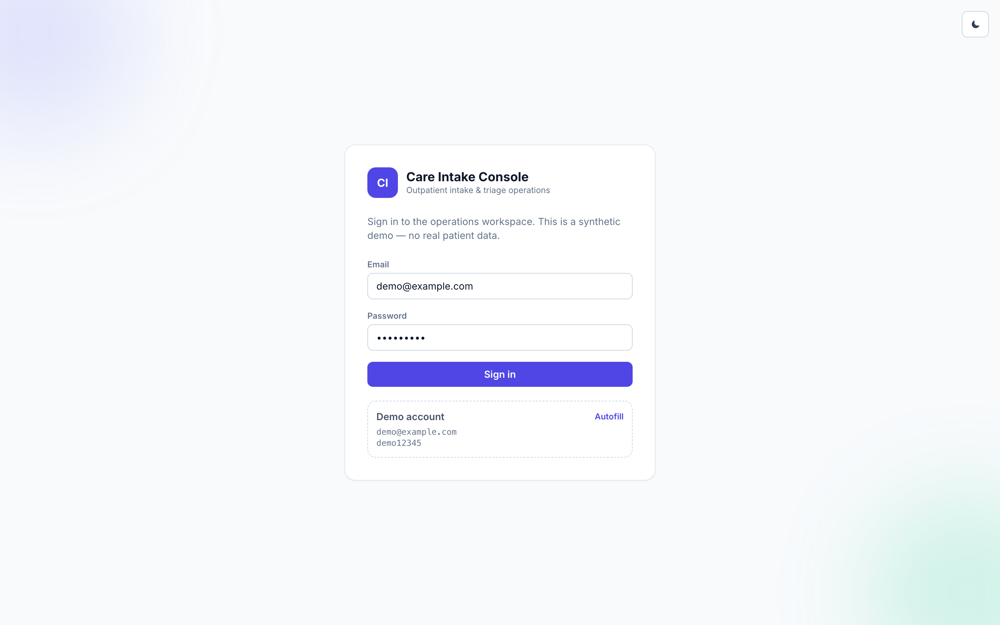
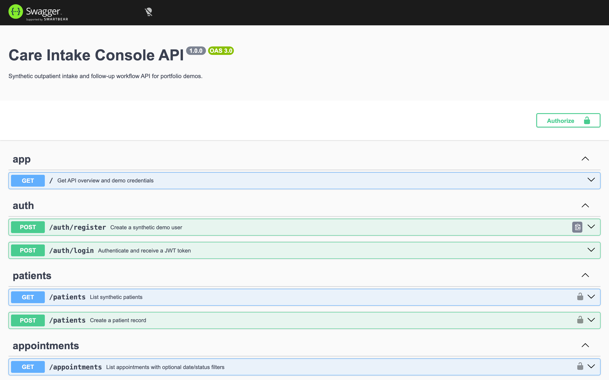
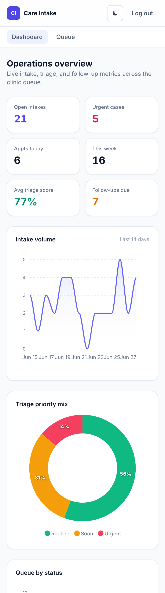
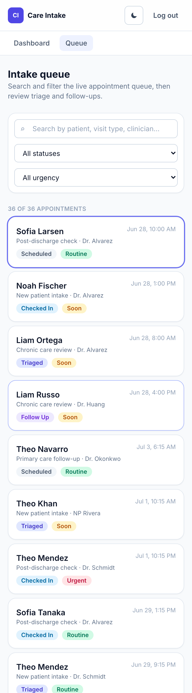

# Care Intake Console — Web

Angular 18 frontend for a **synthetic outpatient intake & triage operations console**.
It is an internal-tool style dashboard: live KPIs, charts, a searchable/filterable
appointment queue, and a triage + follow-up review workflow, all backed by the
[`care-intake-console-api`](https://github.com/K1ngp1nDev/care-intake-console-api) (NestJS).

> Portfolio demo with **synthetic data only** — no real patient data and no medical advice.

## What it demonstrates

- A **custom operations dashboard / admin panel** built end-to-end against a REST API.
- KPI cards, an intake-volume trend, a triage-priority breakdown, and a queue-by-status chart.
- A **searchable, filterable queue** (by patient/clinician, status, urgency) with a
  master–detail panel for triage review and follow-up tasks.
- **Light/dark theme** (class-based Tailwind, persisted to `localStorage`) and a fully
  **responsive layout** (no fixed desktop sidebar on mobile; verified to have no horizontal
  overflow at 360 / 390 / 768 / 1440 px).
- Modern Angular: standalone components, **signals** for state, typed HTTP client, route guards.



<table>
  <tr>
    <td width="50%"></td>
    <td width="50%"></td>
  </tr>
  <tr>
    <td width="50%"></td>
    <td width="50%"></td>
  </tr>
</table>

<p align="center">
  
  &nbsp;
  
</p>

## Stack

- Angular 18 (standalone components + signals)
- Tailwind CSS (class-based dark mode)
- ApexCharts (via `ng-apexcharts`)
- JWT session against the NestJS API

## Features

- **Login** with the demo account shown on screen.
- **Dashboard** — open intakes, urgent cases, appointments today/this week, average triage
  confidence, follow-ups due; intake-volume area chart, triage-priority donut, status bar chart;
  follow-ups-due list with completion rate.
- **Queue** — search + status + urgency filters; appointment cards; detail panel with patient
  info, triage suggestion (confidence, missing-info & follow-up checklists), Accept/Reject and
  generate-follow-ups actions, and follow-up tasks.
- Light/dark theme toggle, responsive across mobile → desktop, loading/empty/error states.

## Run

Start the API first (see the API repo), then:

```bash
npm install
npm start          # http://localhost:4200
```

The app expects the API at `http://127.0.0.1:3000`.

**Demo account:** `demo@example.com` / `demo12345`

## Screenshots

Screenshots live in [`docs/screenshots/`](docs/screenshots). All are kept ≤ 4000×4000 px.
Verify with:

```bash
node docs/check-screenshots.mjs
```
